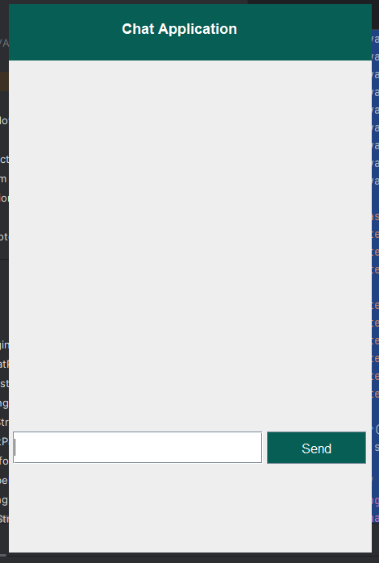

# Live Chat App - JAVA OOP Project

## Overview
This app uses the **XAMPP MySQL database** for login and registration authentication, allowing users to securely log in and interact through a chat interface.

## Steps to Run the Project

Follow these steps to set up and run the project:

1. **Install IntelliJ IDEA**: Download and install IntelliJ IDE for Java development. [Download IntelliJ IDEA](https://www.jetbrains.com/idea/download/)
2. **Install XAMPP**: Install XAMPP to run Apache and MySQL servers locally. [Download XAMPP](https://www.apachefriends.org/download.html)
3. **Download MySQL JDBC Driver**: Download the MySQL JDBC driver and add it to your project’s module. [Download JDBC Driver](https://dev.mysql.com/downloads/connector/j/)

## Screenshots

### 1. Login Interface
The user will be prompted to log in with their credentials.

<div align="center">
  
  
  
</div>

## Features

- **Secure Login**: User authentication via MySQL.
- **Real-time Chat**: Communication in real-time using Java.
- **Customizable UI**: Modern and user-friendly interfaces.

## Installation & Setup

1. Clone the repository to your local machine:
   ```bash
   git clone https://github.com/mojahid2021/liveChat-java-OOP.git


